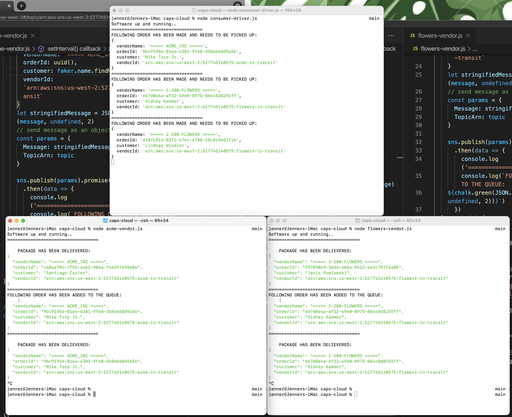
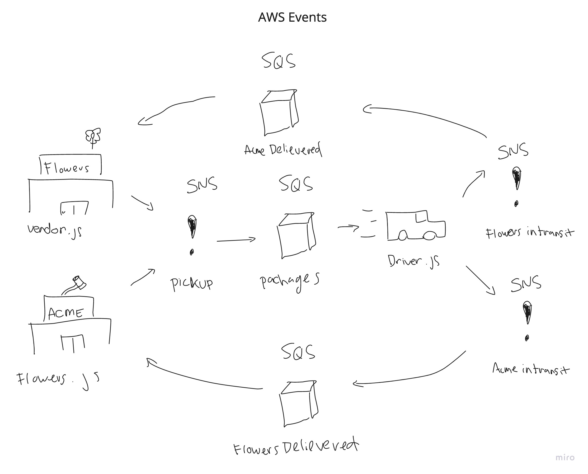

# caps-cloud

## AWS Simple Notification Service

- Amazon Simple Notification Service (Amazon SNS) is a managed service that provides message delivery from publishers to subscribers (also known as producers and consumers). Publishers communicate asynchronously with subscribers by sending messages to a topic, which is a logical access point and communication channel. Clients can subscribe to the SNS topic and receive published messages using a supported endpoint type, such as Amazon Kinesis Data Firehose, Amazon SQS, AWS Lambda, HTTP, email, mobile push notifications, and mobile text messages (SMS).

### Topics

- As part of an SNS, A topic is similar to a `socket.on('event', payload)` listener, where when **pinged** passes an event object (created from a file where the listener is pinged) and passes that information to **subscribers** of the topic.

### Subscribers

- Subscribers are endpoints to where the data received from a topic should be handled
- Subscribers can be the following:
  - AWS SQS
  - AWS Lambda Function
  - Email
  - Mobile Push Notification
  - Mobile Text Message and many other things!

## AWS Simple Query Service

- Amazon SQS (Simple Queue Service) is designed for a cloud computing environment and accomplishes a similar goal. It is a message queuing service that allows you to run business applications and services so that the messaging is not dependent on the IT infrastructure itself. This means the messages can run and fail independently of each other in a way that does not cause slowdowns, system-wide faults, or a disturbance within the application.
- AWS SQS Can be used as subscribers to a topic were, if a subscriber, will push items into the queue. These items will then be handled in orderly fashion by using the `sqs-consumer` node package.

## AWS SDK

- AWS SDK is a node package that allows your to ping topics, passing data through the event object where the data is then passed on to the topic's subscribers

```javascript
const AWS = require('aws-sdk');
AWS.config.update({ region: 'us-west-2' });
const sns = new AWS.SNS();

const topic = 'arn:aws:sns:us-west-2:527745140575:pickup'
const message = {
  vendorName: '===== ACME_INC =====',
  orderId: uuid(),
  customer: faker.name.findName(),
  vendorId: `arn:aws:sns:us-west-2:527745140575:acme-in-transit`
}
let stringifiedMessage = JSON.stringify(message, undefined, 2)
// send message as an object through the params
const params = {
  Message: stringifiedMessage,
  TopicArn: topic
}

sns.publish(params).promise()
  .then(data => {
    console.log('===================================')
    console.log(`FOLLOWING ORDER HAS BEEN ADDED TO THE QUEUE:
${chalk.green(JSON.stringify(message, undefined, 2))}`)
  })
```

- Import AWS-SDK
- Requires a topic that you want to target and ping
- Here were sending a mesage object with some information
  - vendorId: Is later used by the driver. The driver uses the arn as one of the parameters to ping to thie acme-in-transit TOPIC
- You using AWS, the message needs to be stringified when being passed through AWS Software and parsed on the receiving end
- `params` can be named anything and is used as an argument
- 'publish' or 'publishing' is what pings the topic designated in the `TopicArn`

## Consumer

- SQS-CONSUMER is a node package that is used to process AWS SQS queues.

```javascript
const { Consumer } = require('sqs-consumer');

const app = Consumer.create({
  queueUrl: 'https://sqs.us-west-2.amazonaws.com/527745140575/ACME_Inc',
  handleMessage: async (message) => {
    const parseBody = JSON.parse(message.Body);
    const parsedData = JSON.parse(parseBody.Message)
    console.log('===================================')
    console.log(`
    PACKAGE HAS BEEN DELIEVERED:`)
    console.log(chalk.green(parsedData.Message))
  }
})

app.start()
```

- Basic use case is to import the package
- Create the connection to the specified queue by entering the unique URL
- `handleMessage` Each item within the queue is processed through this call back function
- `app.start()` is needed to continuously process the queue and to start the functionality

## SQS-PRODUCER

- SQS PRODUCER is a node package that is able to push items directly into an SQS Queue without having to go through a SNS TOPIC

```javascript
const { Producer } = require('sqs-producer')
let producer = Producer.create({
  queueUrl: 'https://sqs.us-west-2.amazonaws.com/527745140575/ACME_Inc',
  region: 'us-west-2'
})

setInterval(async () => {
  try {
    const message = {
      orderId: uuid(),
      customer: faker.name.findName(),
      vendorId: `arn:aws:sqs:us-west-2:527745140575:ACME_Inc`
    }
    const response = await producer.send(message)
    console.log(response)
  } catch(e) {
    console.error(e);
  }
}, Math.floor(Math.random() * 3000))

```

- Enter the URL of the queue where you want to pass the items to
- Set the correct region
- Requires async await

## General Notes

- Consumer files:
  - acme-vendor.js
  - flowers-vendor.js
  - consumer-driver.js

- SNS Topics in this project were:
  - pickup
    - Subscriber: 'packages' (SQS)
  - acme-in-transit
    - Subscriber: 'ACME_Inc' (SQS)
  - flowers-in-transit
    - Subscriber: '1-200-Flowers' (SQS)

### Takeaways / Code Blocks

- I had trouble with debugging and trouble shooting
  - Making a lambda function that prints out event information and making it a subscriber to a topic and utilizing cloud watch helped to see the overall object structure
- I had a breakthrough when I realized that you can make a consumer file also ping topics as used in the `consumer-driver.js` file

```javascript
'use strict';

// HANDLES OBJECTS WITHIN THE SPECIFIED QUEUE
const { Consumer } = require('sqs-consumer');
const AWS = require('aws-sdk');
AWS.config.update({ region: 'us-west-2' });
const sns = new AWS.SNS();

console.log('Software up and running..')
// handles items thaat are within this queue
const app = Consumer.create({
  queueUrl: 'https://sqs.us-west-2.amazonaws.com/527745140575/packages',
  handleMessage: async (message) => {
    const parseBody = JSON.parse(message.Body);
    const parsedData = JSON.parse(parseBody.Message)
    // To be published
    const params = {
      Message: message.Body,
      TopicArn: parsedData.vendorId
    }
    sns.publish(params).promise()
      .then(data => {
        console.log('===================================')
        console.log(`FOLLOWING ORDER HAS BEEN MADE AND NEEDS TO BE PICKED UP:`)
        console.log(parsedData)
      })
      .catch(console.error);
  }
})

app.start()

```

- I was at first having trouble of how I would be able to utilize a `sqs-produce` since it was used as an example in the class demo. However, I ended up not having to use it at all

### How To Use

- `npm i`
- `node consumer-driver.js`
- `node acme-vendor.js` and or `node flowers-vendor.js`

### Workflow

1. Create A SNS Topic
2. Create A SQS Queue and subscribe to topic
3. Create vendor.js

- Pings SNS Topic and passes information to its subscribers
- Consumer of a SQS Queue, allows notification of successfully delievered items

4. Create a driver.js

- Consumer of an SQS Queue and handles items within queue
- Pings a **different** SNS Topic to pass on the information to a **different** queue (delievered)



